# Architecture

This repository uses a LangGraph state machine to run a layered incident-response workflow over a shared `AgentState`. The current implementation is a scaffold: the graph is fully wired, but the forensic nodes are still deterministic placeholders until the SIFT Workstation is available.

## Mermaid Diagram

```mermaid
flowchart LR
    U[User / CLI] --> A[app.py: build_initial_state]
    A --> G[graph.py: build_graph]
    G --> AT[audit_trail]

    subgraph L0[Layer 0 - Foundation]
        EI[evidence_integrity]
        DT[basic_disk_triage]
    end

    subgraph L1[Layer 1 - Core Analysis]
        MA[memory_analysis]
        TI[threat_intel_lookup]
        AD[active_vs_dormant_determination]
        NS[negative_space_reasoning]
    end

    subgraph L2[Layer 2 - Cross-Referencing]
        DC[disk_memory_correlation]
        MM[mitre_mapping]
        RG[evidence_relationship_graph]
        CC[confidence_calibration]
    end

    subgraph L3[Layer 3 - Higher-Order Reasoning]
        HI[hypothesis_driven_investigation]
        BR[blast_radius_assessment]
        AP[attacker_perspective]
        PN[predictive_next_step_reasoning]
        TR[timeline_reconstruction]
    end

    subgraph L4[Layer 4 - Output and Meta]
        ED[escalation_decision]
        IOC[ioc_extraction]
        AB[accuracy_benchmarking]
        DR[dual_audience_reporting]
        RP[remediation_playbook]
        SC[self_correction_loop]
    end

    E[(Evidence files)] -. read-only paths .-> EI
    EI --> DT --> MA
    MA --> TI --> AD --> NS
    NS --> DC --> MM --> RG --> CC
    CC --> HI --> BR --> AP --> PN --> TR
    TR --> ED --> IOC --> AB --> DR --> RP --> SC
    SC -->|retry_requested and iteration_count < max_iterations| G
    SC -->|stop| O[Final reports, remediation steps, audit log]
```



## ASCII Diagram

```text
                 +----------------------+
                 |      User / CLI      |
                 +----------+-----------+
                            |
                            v
                 +----------------------+
                 |   app.py seeds state  |
                 +----------+-----------+
                            |
                            v
                 +----------------------+
                 |  graph.py / StateGraph|
                 +----------+-----------+
                            |
            +---------------+---------------+
            |                               |
            v                               v
   +-------------------+           +-------------------+
   | audit_trail node  |           | evidence boundary  |
   +-------------------+           | (read-only paths)  |
                                    +---------+---------+
                                              |
                                              v
   +-------------------+    +-------------------+    +-------------------+
   | Layer 0 nodes     | -> | Layer 1 nodes     | -> | Layer 2 nodes     |
   | evidence_integrity|    | memory / intel    |    | correlation / map |
   | basic_disk_triage |    | active / negative |    | graph / confidence|
   +-------------------+    +-------------------+    +-------------------+
                                              |
                                              v
   +-------------------+    +-------------------+    +-------------------+
   | Layer 3 nodes     | -> | Layer 4 nodes     | -> | self_correction   |
   | hypotheses        |    | escalation / IOC  |    | loop with cap     |
   | blast radius etc. |    | reports / playbook|    | retry or stop     |
   +-------------------+    +-------------------+    +-------------------+
                                              |
                                              v
                                   +----------------------+
                                   | final outputs + logs  |
                                   +----------------------+
```

## Arrow-by-Arrow Walkthrough

1. `User / CLI -> app.py`: `build_initial_state` converts evidence paths and runtime flags into a complete `AgentState` skeleton.
2. `app.py -> graph.py`: `build_graph` compiles the LangGraph state machine and preserves the node order.
3. `graph.py -> audit_trail`: the first node records execution context and starts the audit log.
4. `Evidence files -> evidence_integrity`: evidence is referenced by path only; the current scaffold keeps the boundary read-only.
5. `Layer 0 -> Layer 1`: disk triage and integrity checks feed memory, threat intel, active/dormant, and negative-space reasoning.
6. `Layer 1 -> Layer 2`: confirmed findings are cross-referenced, mapped to ATT&CK, and turned into a relationship graph plus confidence scores.
7. `Layer 2 -> Layer 3`: the graph uses those scored findings to rank hypotheses, assess blast radius, and reconstruct the timeline.
8. `Layer 3 -> Layer 4`: the higher-order conclusions drive escalation, IOC extraction, benchmarking, reporting, and the remediation playbook.
9. `self_correction_loop -> graph.py`: if retry is requested and the iteration cap has not been reached, the graph re-runs a pass; otherwise it stops.
10. `All nodes -> audit log`: every node emits a traceable audit entry so findings can be tied back to the call that produced them.

## Interpretation Notes

- The dotted edge from evidence paths to `evidence_integrity` is the security boundary. It is architectural, not prompt-based.
- The graph is layered on purpose: higher-order reasoning depends on lower-layer outputs instead of bypassing them.
- The self-correction loop is capped by `max_iterations` so the system cannot run away.
- Placeholder node bodies make the control flow testable now, while real SIFT-backed tool calls can be swapped in later without changing the overall graph shape.
